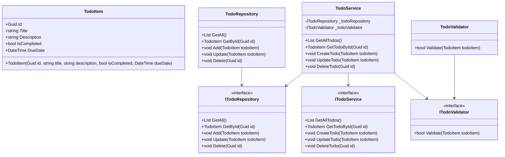

# SOLID
SOLID原則の練習のためのTODOアプリ

```mermaid
classDiagram
    class TodoItem {
        +Guid Id
        +string Title
        +string Description
        +bool IsCompleted
        +DateTime DueDate
        +TodoItem(Guid id, string title, string description, bool isCompleted, DateTime dueDate)
    }

    class ITodoRepository {
        <<interface>>
        +List<TodoItem> GetAll()
        +TodoItem GetById(Guid id)
        +void Add(TodoItem todoItem)
        +void Update(TodoItem todoItem)
        +void Delete(Guid id)
    }

    class TodoRepository {
        +List<TodoItem> GetAll()
        +TodoItem GetById(Guid id)
        +void Add(TodoItem todoItem)
        +void Update(TodoItem todoItem)
        +void Delete(Guid id)
    }

    class ITodoService {
        <<interface>>
        +List<TodoItem> GetAllTodos()
        +TodoItem GetTodoById(Guid id)
        +void CreateTodo(TodoItem todoItem)
        +void UpdateTodo(TodoItem todoItem)
        +void DeleteTodo(Guid id)
    }

    class TodoService {
        -ITodoRepository _todoRepository
        -ITodoValidator _todoValidator
        +List<TodoItem> GetAllTodos()
        +TodoItem GetTodoById(Guid id)
        +void CreateTodo(TodoItem todoItem)
        +void UpdateTodo(TodoItem todoItem)
        +void DeleteTodo(Guid id)
    }

    class ITodoValidator {
        <<interface>>
        +bool Validate(TodoItem todoItem)
    }

    class TodoValidator {
        +bool Validate(TodoItem todoItem)
    }

    TodoRepository --> ITodoRepository
    TodoService --> ITodoService
    TodoService --> ITodoRepository
    TodoService --> ITodoValidator
    TodoValidator --> ITodoValidator
```
